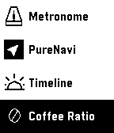
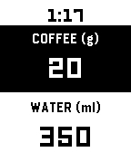

# Simple Coffee Ratio Calculator

A coffee-to-water ratio calculator for the Pebble 2 Duo.

When making pour-over coffee, you measure beans loosely ("around 20 grams") and need to quickly calculate the corresponding water amount. This app puts that calculation on your wrist -- no more grabbing your phone for a calculator.

<p align="center">
  
  &nbsp;&nbsp;
  
</p>

## Features

- **Two-value display**: coffee (g) and water (ml), always in sync
- **Toggle focus**: press Select to switch between adjusting coffee or water
- **Coffee**: adjusts by 1g (range 10-100g)
- **Water**: adjusts by 10ml (range 100-2500ml)
- **Ratio editing**: long-press Select to change the ratio (10-25), with live preview of recalculated values
- **Persistent storage**: ratio and last coffee weight are remembered across sessions
- **Hold to scroll**: hold Up/Down to quickly adjust values

## Default values

- Ratio: 1:17
- Coffee: 20g
- Water: 340ml

## Controls

| Button | Action |
|--------|--------|
| Up / Down | Adjust focused value |
| Select | Toggle focus (coffee / water) |
| Long-press Select | Edit ratio |
| Back | Exit app (or cancel ratio edit) |

## Building

Requires the [Pebble SDK](https://developer.rebble.io/sdk/).

```bash
pebble build
pebble install --emulator diorite    # emulator
pebble install --phone <IP>          # physical watch
```

## Platform

Currently targets **diorite** (Pebble 2). The 144x168 B&W layout should work on aplite and basalt with minimal changes. Chalk (round) would need layout adjustments.
